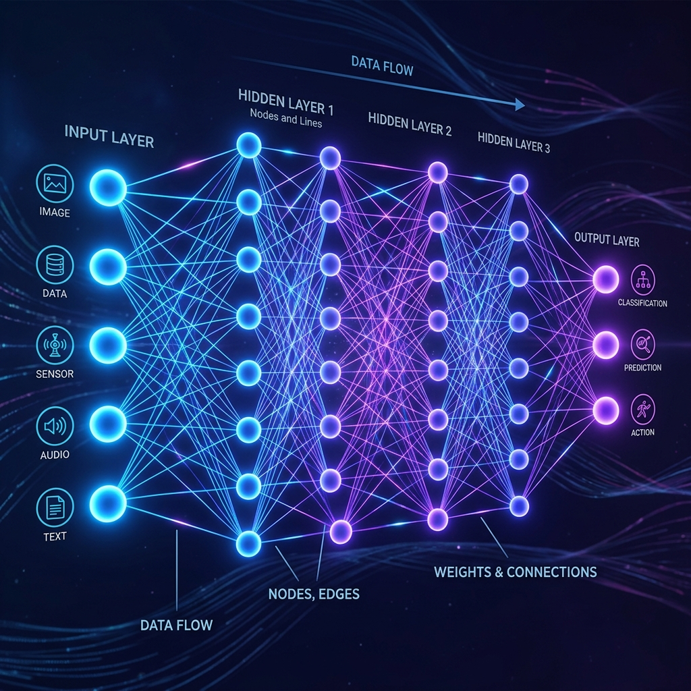
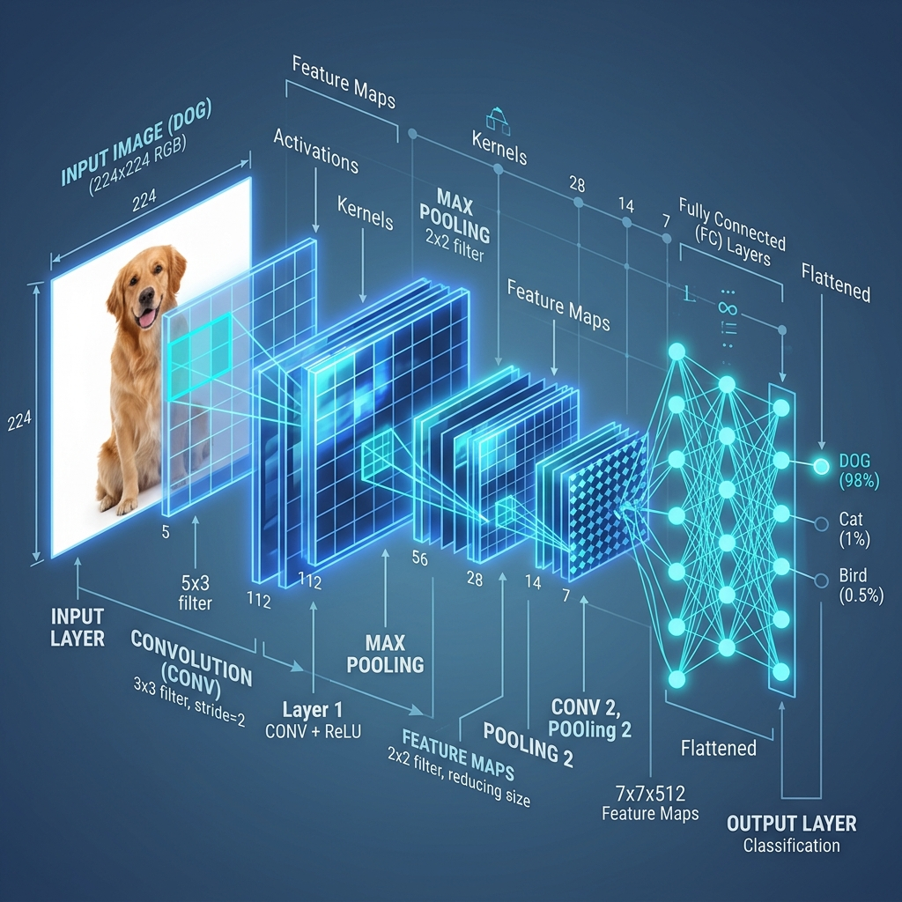
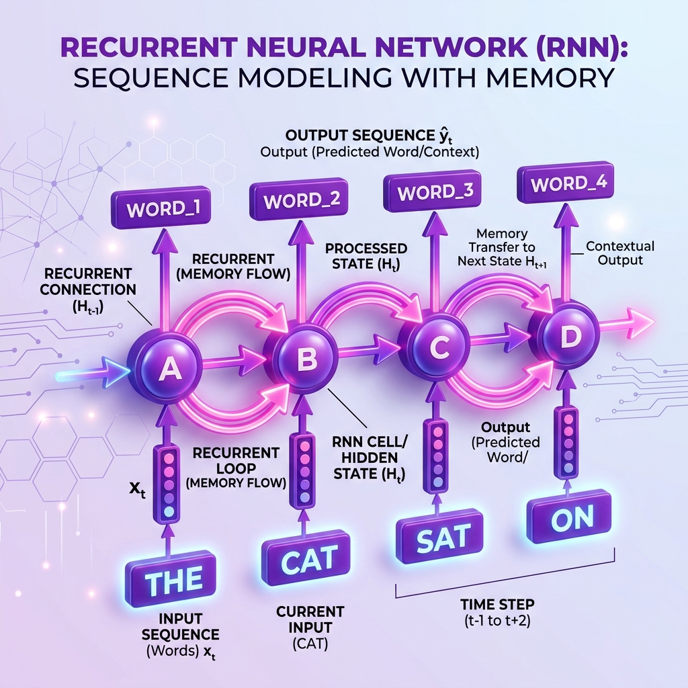
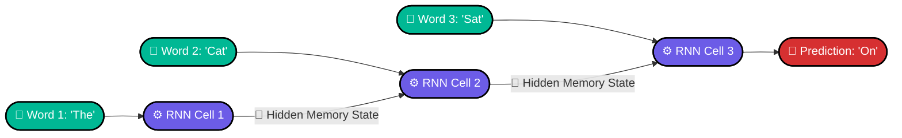
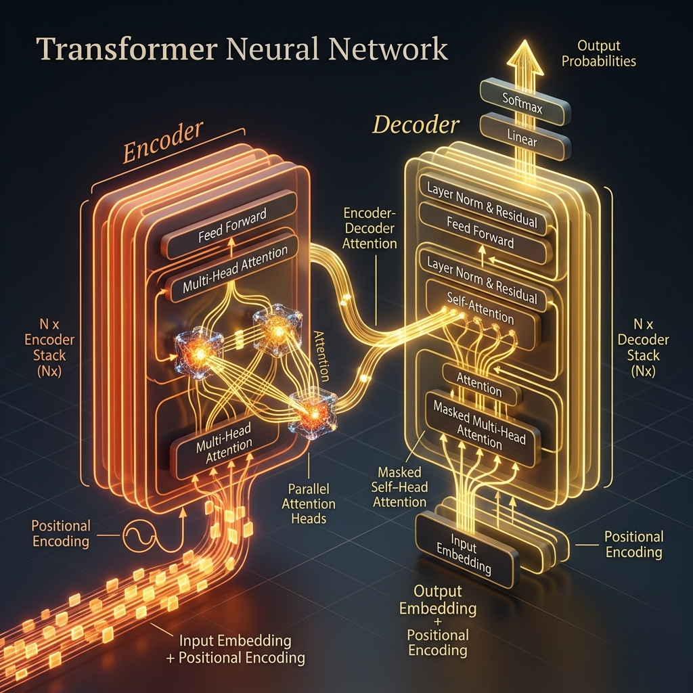
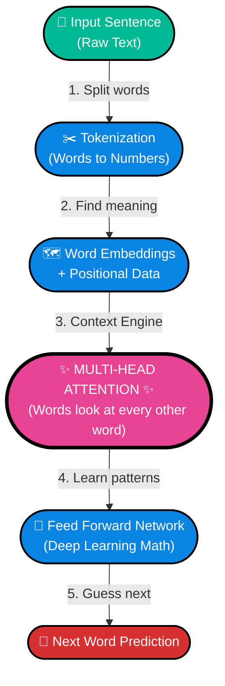

# Topic 3: What is a Neural Network?



## 1. The History: What was the problem?
**The Problem with Traditional Programming:**
Before Neural Networks, if you wanted a computer to recognize a picture of a cat, a human programmer had to write exact, rigid rules: *If shape has pointy ears, and has whiskers, and has a tail, then it is a cat.* But what if the cat is facing away? What if it's a hairless cat? What if the lighting is dark? The `if/else` rules became infinitely complex, and traditional programming completely failed at tasks like vision, language, and creativity.

**Where it started (The Origin):**
In 1957, an American psychologist named Frank Rosenblatt invented the **Perceptron**—the very first artificial neuron, inspired by the biological neurons in the human brain. Instead of telling the computer *how* to find a cat, researchers realized a radical new idea: **What if we just feed the computer 10,000 pictures of cats and let it figure out the rules on its own?**

**What it solved:**
Neural Networks solved the fundamental problem of **Complex Pattern Recognition**. They allowed computers to learn from raw data (experience) instead of relying on rigid, human-written instructions. This paved the way for everything from self-driving cars to ChatGPT.

---

## 2. The Real-World Analogy
Imagine you are trying to guess the price of a house. You look at three things:
1. The number of bedrooms.
2. The square footage.
3. The neighborhood safety score.

In your brain, you weigh these factors to come up with a final price. You know that square footage matters a lot (high weight), while the number of bedrooms might matter slightly less. 

A **Neural Network** is a computer program designed to mimic this exact biological process. It takes inputs, passes them through artificial "neurons" that weigh their importance, and spits out a prediction. If the prediction is wrong, the network adjusts its internal weights to do better next time. This adjustment process is what we call **"Learning"**.

---

## 3. The Architecture (How it is built)
Every Neural Network consists of three main parts:
1. **Input Layer**: Where the raw data enters (e.g., the house features, or the pixels of an image).
2. **Hidden Layers**: The "brain tissue". These layers process the information, finding hidden patterns. Deep Learning gets its name because there are many (deep) hidden layers.
3. **Output Layer**: The final prediction (e.g., the house price, or the next word in a sentence).

### Visualizing the Data Flow
Here is exactly how data moves through a standard Neural Network. *(Notice how every single node connects to every node in the next layer).*

🔥 **[CLICK HERE TO OPEN THE INTERACTIVE CANVAS VISUALIZATION](file:///C:/Users/Varun/Desktop/SLM_Project/Course_Notes/Phase1_DeepLearning_Foundations/interactive_canvas.html)** 🔥
*(Open this file in your web browser to see the live, animated data flowing through the network!)*

```mermaid
flowchart LR
    classDef input fill:#00b894,stroke:#000,stroke-width:2px,color:#fff,rx:50,ry:50
    classDef hidden fill:#6c5ce7,stroke:#000,stroke-width:2px,color:#fff,rx:50,ry:50
    classDef output fill:#d63031,stroke:#000,stroke-width:2px,color:#fff,rx:50,ry:50
    
    subgraph Input Data
    I1(["🔢 Sq. Footage"]):::input
    I2(["🛏️ Bedrooms"]):::input
    end
    
    subgraph Hidden Layer 1 (Brain)
    H11(["🧠 Neuron"]):::hidden
    H12(["🧠 Neuron"]):::hidden
    H13(["🧠 Neuron"]):::hidden
    end
    
    subgraph Hidden Layer 2 (Brain)
    H21(["🧠 Neuron"]):::hidden
    H22(["🧠 Neuron"]):::hidden
    H23(["🧠 Neuron"]):::hidden
    end
    
    subgraph Prediction
    O1(["💰 House Price"]):::output
    end
    
    I1 & I2 --> H11 & H12 & H13
    H11 & H12 & H13 --> H21 & H22 & H23
    H21 & H22 & H23 --> O1
```

> [!TIP]
> This specific architecture is called a **Fully Connected Neural Network (FCNN)**.

---

## 4. The ML Universe: In-Depth Neural Network Types
While we are going to build an SLM, you must understand the complete landscape. Here are the 4 main types of Neural Networks and their futuristic workflow nodes.

### A. Fully Connected Neural Networks (FCNN / MLP)
*(See the first diagram at the top of the page).*
* **What it is:** The classic architecture where every neuron connects to every neuron in the next layer.
* **Use Case:** Tabular data (Excel spreadsheets), simple classification, predicting housing prices.
* **PyTorch Code Example:**
```python
import torch.nn as nn
model = nn.Sequential(
    nn.Linear(in_features=3, out_features=10),
    nn.ReLU(),
    nn.Linear(in_features=10, out_features=1)
)
```

### B. Convolutional Neural Networks (CNNs)

* **What it is:** CNNs don't look at all pixels at once. Instead, they use a sliding window (a "filter") that scans across an image to detect edges, curves, and eventually complex objects like faces.
* **Use Case:** Computer Vision (Self-driving cars, facial recognition).
* **N8N-Style Visual Workflow:**


```mermaid
flowchart LR
    classDef input fill:#00b894,stroke:#000,stroke-width:2px,color:#fff,rx:10,ry:10
    classDef process fill:#0984e3,stroke:#000,stroke-width:2px,color:#fff,rx:10,ry:10
    classDef output fill:#d63031,stroke:#000,stroke-width:2px,color:#fff,rx:10,ry:10
    
    A(["📸 Input Image<br>(Raw Pixels)"]):::input -->|Feeds into| B(["🟦 Conv2D Filter<br>(Finds Edges)"]):::process
    B -->|Creates| C(["🔲 Feature Map<br>(Highlights Patterns)"]):::process
    C -->|Shrinks| D(["📉 MaxPooling<br>(Reduces Size)"]):::process
    D -->|Reshapes| E(["📏 Flatten<br>(1D Array)"]):::process
    E -->|Predicts| F(["🎯 FCNN Output<br>(Dog vs Cat)"]):::output
```

### C. Recurrent Neural Networks (RNNs)

* **What it is:** RNNs process data in a sequence (one word at a time) and maintain a "hidden state" (a memory loop) of what they just saw. 
* **Use Case:** Sequential data like stock market prediction and early Google Translate.
* **N8N-Style Visual Workflow:**


### D. Transformers (The LLM Engine)

* **What it is:** Invented by Google in 2017, Transformers destroyed RNNs. Instead of reading word-by-word (which is slow and forgets early words), they read the *entire sentence at once* using an **"Attention Mechanism"** that learns which words are related to each other regardless of distance.
* **Use Case:** Large Language Models (ChatGPT, Claude, Gemini).
* **N8N-Style Visual Workflow:**


---

## 5. Summary
A Neural Network is just a chain of math equations attempting to map an Input to an Output. The network "learns" by making mistakes, looking at the correct answer, and tweaking its internal math (Weights) so it doesn't make that mistake again.

---

## 6. Knowledge Check Quiz

**Q1: What fundamental problem did the invention of Neural Networks solve compared to traditional programming?**
* **Answer:** It allowed computers to learn from raw data (patterns) instead of relying on rigid if/else rules.

**Q2: If you were hired to build an AI system that scans medical X-Rays to detect bone fractures, which architecture would you choose?**
* **Answer:** Convolutional Neural Network (CNN). (Because CNNs use filters to scan images for edges and shapes, rather than looking at every pixel simultaneously like an FCNN).

**Q3: In a Neural Network, what actually happens mathematically when the network 'learns' from a mistake?**
* **Answer:** It slightly adjusts its internal 'Weights' so the prediction is closer to the true answer next time. (It does not grow new layers; it simply changes how much it trusts the current inputs). 
