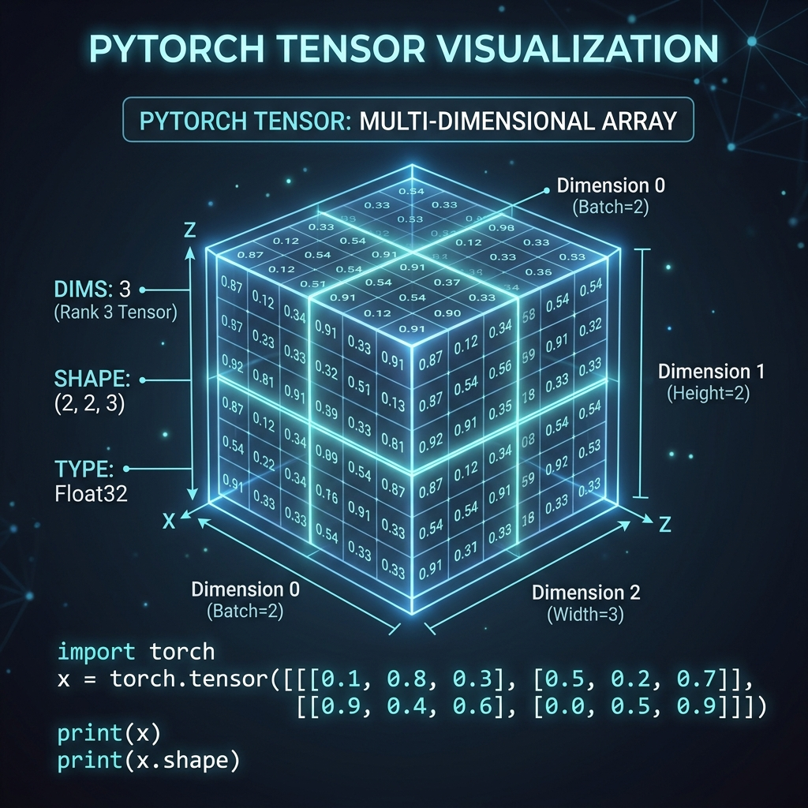
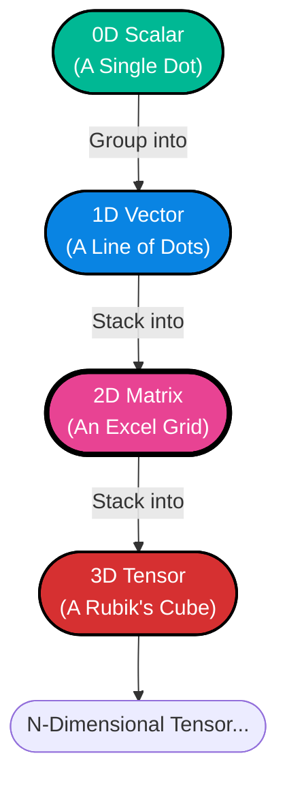
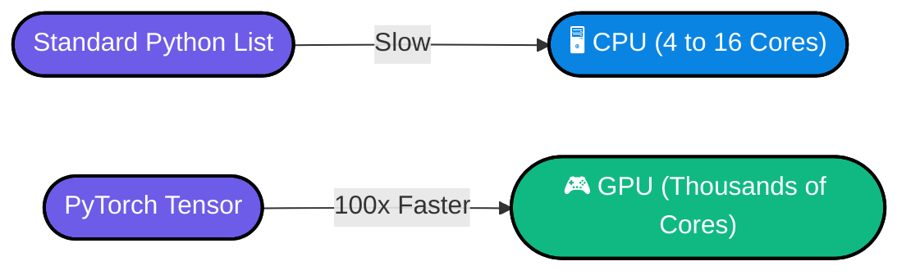

# Topic 4: Tensors (The Language of PyTorch)

## 1. What is a Tensor? (The Real-World Analogy)
Imagine an empty egg carton. It exists just to hold eggs in a highly organized, structural grid. 

In Deep Learning, a **Tensor** is our egg carton, but instead of holding eggs, it holds numbers. A Neural Network is completely incapable of understanding words, images, or sound. It can only understand Tensors. 

If you are building an LLM, every single English word you type is translated into a number, placed into a massive Tensor, and fed into the Neural Network.

## 2. Dimensions (The Shape of Data)
The most important concept in PyTorch is **Shape**. If the shape of your Tensors don't match, your entire AI crashes. Here is how Tensors scale up:

* **0D (Scalar):** Just one single number. E.g., `5`.
* **1D (Vector):** A list of numbers. E.g., `[1, 2, 3]`. Often used to represent a single word.
* **2D (Matrix):** A grid with Rows and Columns. Used to represent a Black & White image.
* **3D (Tensor):** A cube of numbers. Used to represent a Colored Image (Height × Width × 3 RGB colors) or a Batch of Sentences in an LLM.

## 3. Why use PyTorch Tensors instead of standard Python Lists?
If you already know Python, you might be asking: *Why can't I just use a standard Python list like `my_list = [1, 2, 3]`?*

There are two massive reasons we use PyTorch Tensors:

### Reason 1: The GPU (Graphics Card) Speed
Standard Python lists are processed on your CPU (Central Processing Unit). A CPU typically has about 4 to 16 "cores", meaning it can only do a few math problems at the exact same time.
A GPU (Graphics Processing Unit) has **thousands** of cores. PyTorch Tensors are specially engineered to be shipped off to the GPU, allowing them to do millions of calculations simultaneously.

### Reason 2: Autograd (Automatic Calculus)
When an AI learns, it uses a form of Calculus called "Derivatives" to figure out exactly how wrong its answer was so it can fix it. Doing this math manually is a nightmare. PyTorch Tensors have a feature called **Autograd** which automatically tracks and solves all the calculus in the background for you without you ever writing a single calculus equation!

---

## 4. Knowledge Check Quiz

**Q1: If you have a Tensor that holds a standard Black & White image, what is its mathematical Shape/Dimension?**
* **Answer:** 2D Matrix (Rows × Columns).

**Q2: Why do we use PyTorch Tensors instead of standard Python lists when building an LLM?**
* **Answer:** Because Tensors can be sent to a GPU for massive parallel speed and have Autograd for automatic calculus.

**Q3: What does the code `requires_grad=True` tell PyTorch to do?**
* **Answer:** To track every math operation performed on the Tensor so it can solve the calculus derivatives later. ("Grad" stands for Gradient. This turns on a hidden tape recorder to monitor math operations for future learning).
