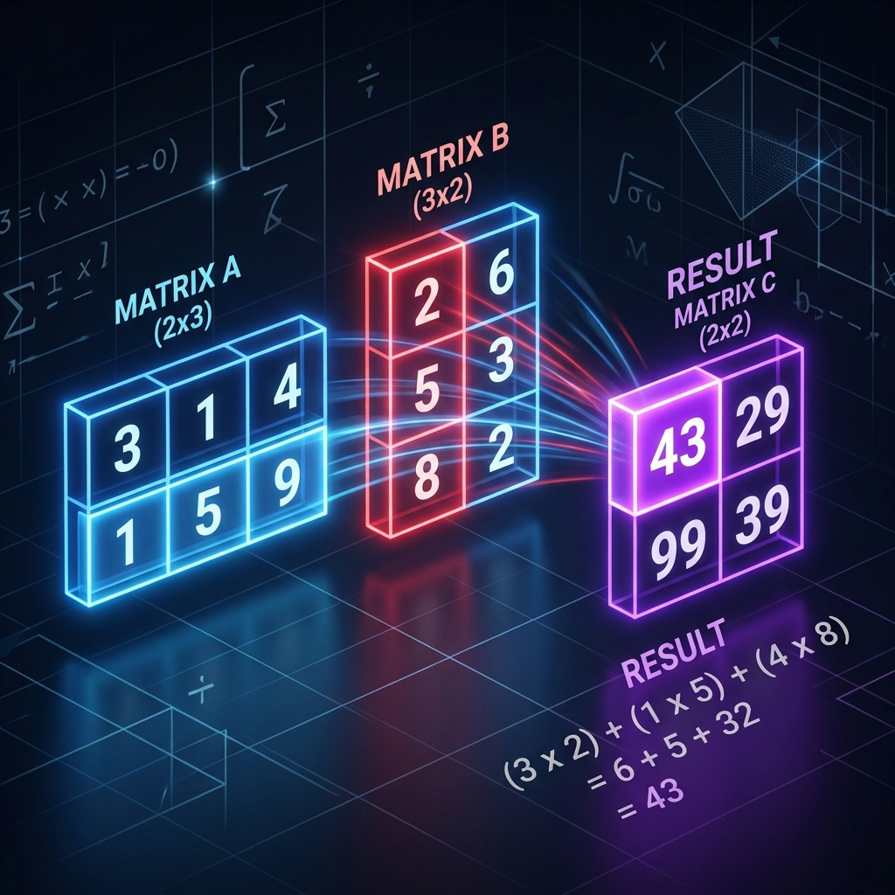

# Topic 5: Matrix Multiplication (Dot Products)



## 1. Why do we need to multiply Matrices?
In a Neural Network, every piece of data is a Tensor. 
If we have an **Input** (like the number of bedrooms) and a **Weight** (how important bedrooms are), we need to mathematically combine them to make a prediction. 

Because Neural Networks process millions of inputs and weights simultaneously, we don't multiply them one-by-one. That would be far too slow. Instead, we smash entire grids of numbers (Matrices) together at the exact same time using the GPU. This is called **Matrix Multiplication**.

## 2. The Core Formula: The Dot Product
The fundamental mathematical operation behind all of Machine Learning (including ChatGPT's entire brain) is the **Dot Product**.

Let's look at the exact mathematical formula for a Dot Product between two Vectors (1D Tensors):

$$ \text{Dot Product} = (A_1 \times B_1) + (A_2 \times B_2) + (A_3 \times B_3) ... $$

It simply multiplies the matching pairs of numbers across the two lists, and then adds all the results together into one single final sum.

## 3. Visualizing the Dot Product
Imagine multiplying a 1x3 Row Vector by a 3x1 Column Vector. 
The golden rule for Matrix Multiplication is **Rows $\times$ Columns**.

```mermaid
flowchart LR
    classDef row fill:#0984e3,stroke:#000,stroke-width:2px,color:#fff,rx:5,ry:5
    classDef col fill:#e84393,stroke:#000,stroke-width:2px,color:#fff,rx:5,ry:5
    classDef output fill:#6c5ce7,stroke:#000,stroke-width:2px,color:#fff,rx:5,ry:5
    
    subgraph Row Vector (Inputs)
    R1([1]):::row
    R2([2]):::row
    R3([3]):::row
    end
    
    subgraph Column Vector (Weights)
    C1([4]):::col
    C2([5]):::col
    C3([6]):::col
    end
    
    subgraph Dot Product Output (Sum)
    O([32]):::output
    end
    
    R1 -->|1 * 4 = 4| O
    R2 -->|2 * 5 = 10| O
    R3 -->|3 * 6 = 18| O
```

> [!IMPORTANT]
> **The Shape Rule:** You cannot multiply matrices randomly. The "inner" dimensions MUST match.
> If Matrix A has a shape of `(2, 3)` and Matrix B has a shape of `(3, 4)`, they CAN multiply because the inner `3` matches! 
> The resulting Matrix shape will be the outer numbers: `(2, 4)`.
