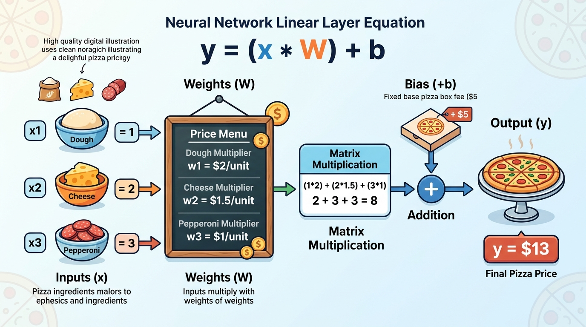
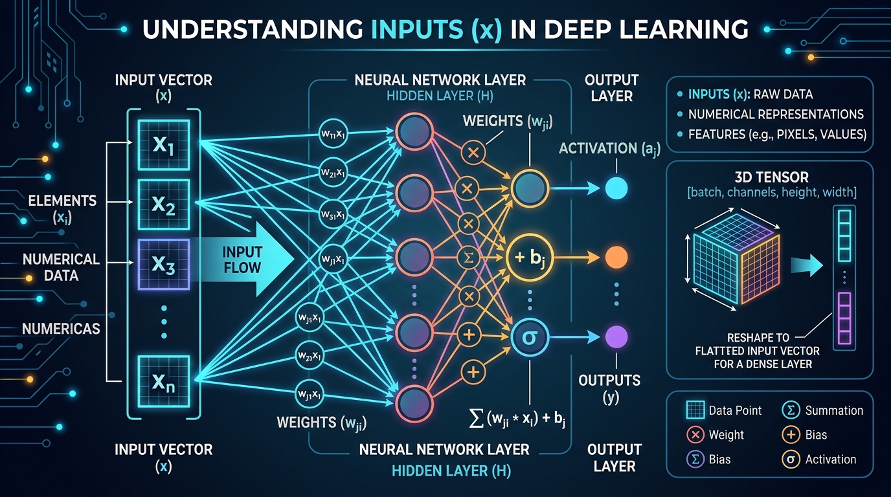
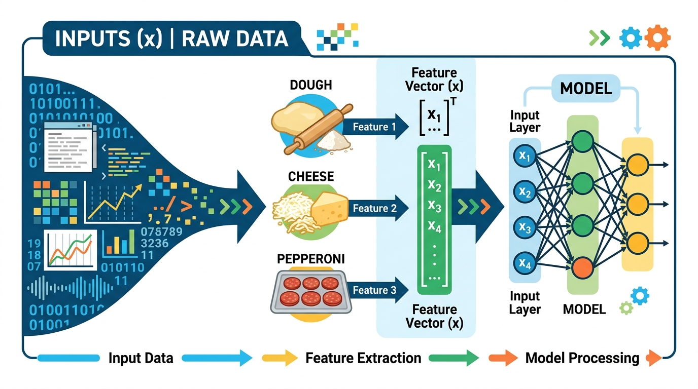
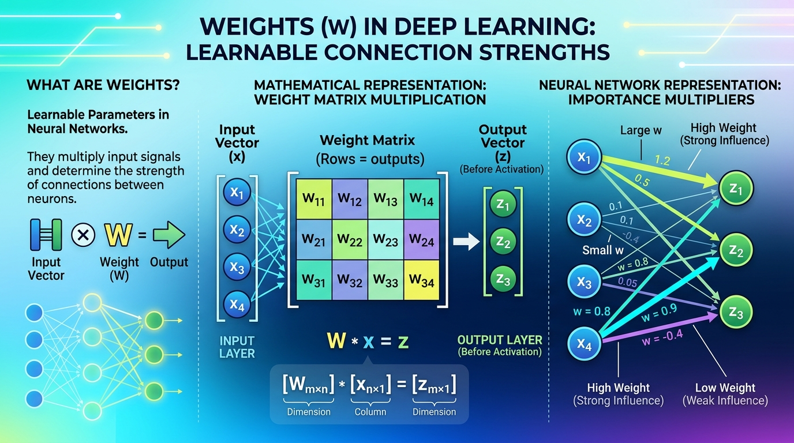
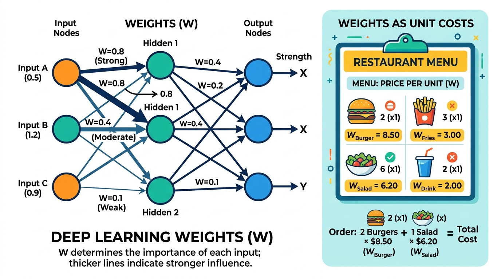
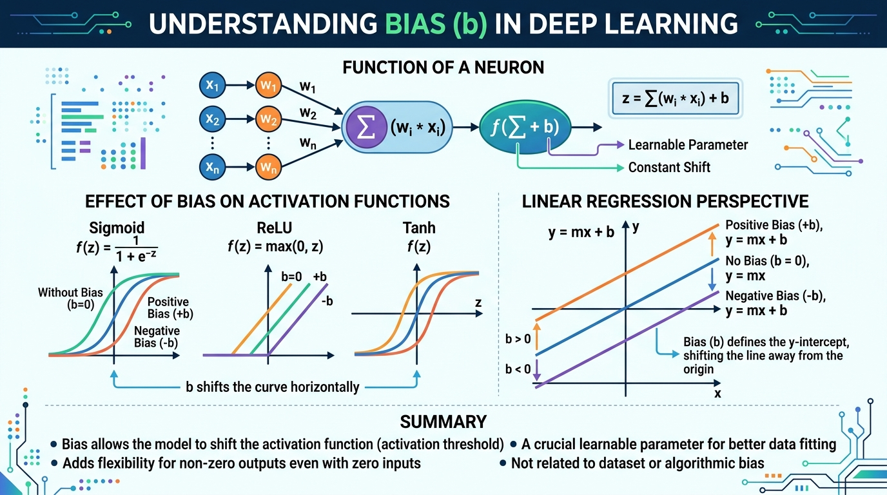
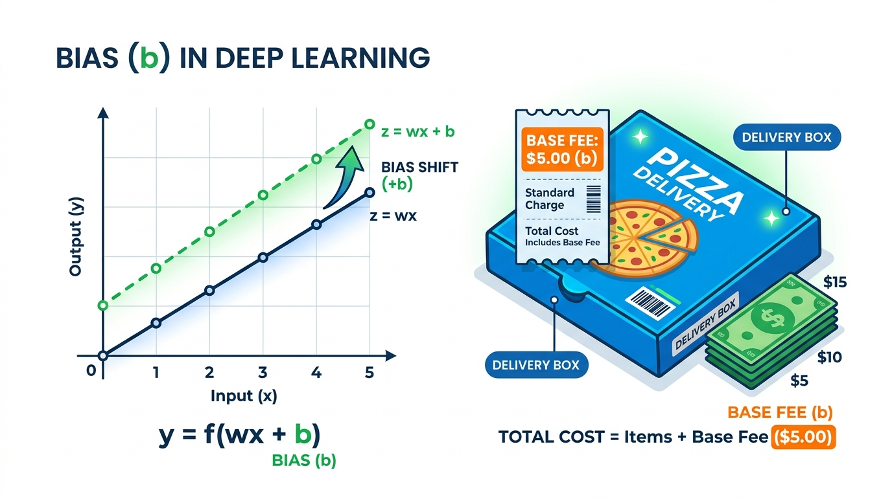
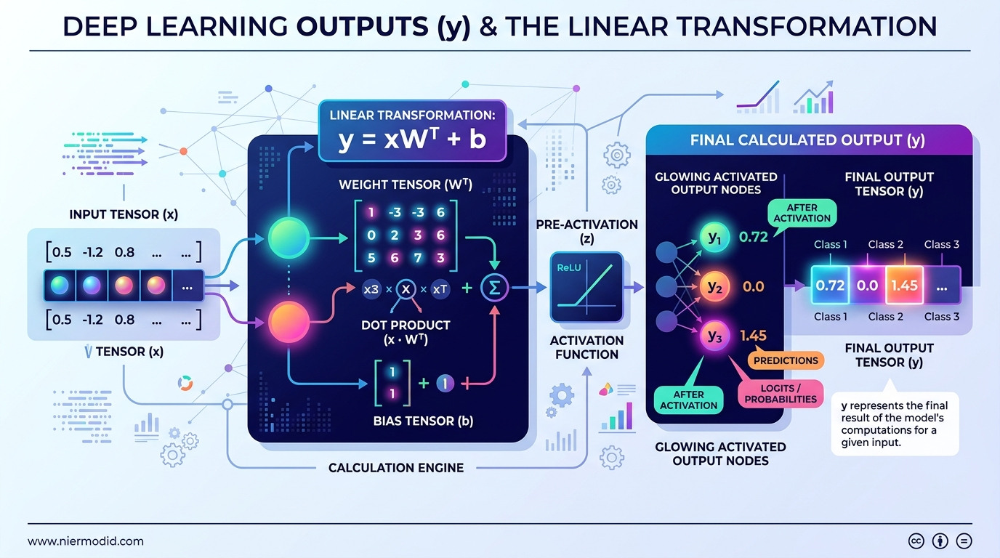
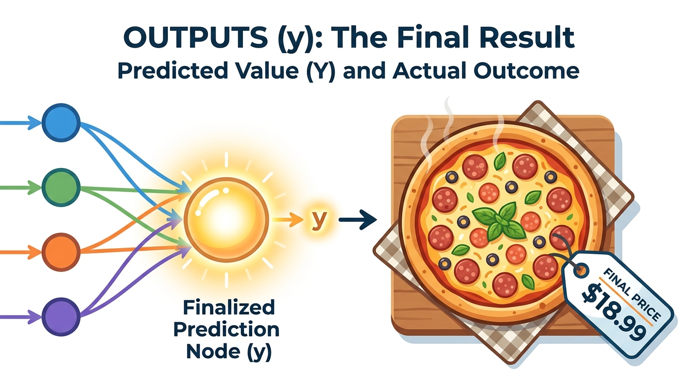
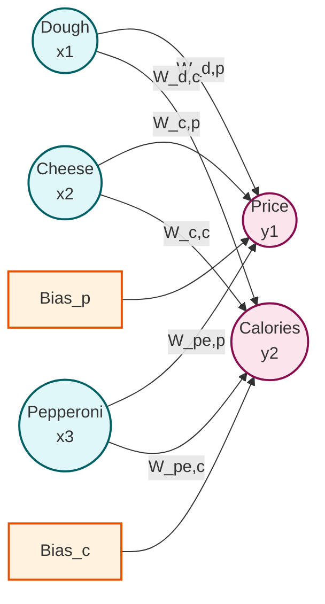

# Topic 6: Linear Layers (Weights and Biases)

Welcome to the heart of the neural network! If tensors are the data, and matrix multiplication is the machinery, then **Linear Layers** are the actual components that learn and transform the data. 

Often called "Fully Connected Layers" or "Dense Layers," linear layers are responsible for taking information, assigning importance to different parts of it, and producing a new representation.

---

## 1. The Real-World Analogy: Pricing a Pizza

Imagine you are managing a pizza shop, and you want to automatically calculate the price of a custom pizza based on its ingredients.

You have three main ingredients:
1. **Dough** (in grams)
2. **Cheese** (in grams)
3. **Pepperoni** (number of slices)

How do you determine the price? You assign a **cost per unit (Weight)** to each ingredient, and you have a **fixed base fee (Bias)** for the box and baking.

* **Price** = (Dough × Dough_Cost) + (Cheese × Cheese_Cost) + (Pepperoni × Pepperoni_Cost) + Base_Fee

In the language of Deep Learning:
* The amounts of ingredients are your **Inputs ($x$)**.
* The costs per unit are the **Weights ($W$)**.
* The fixed base fee is the **Bias ($b$)**.
* The final price is your **Output ($y$)**.

> [!TIP]
> The Neural Network's entire job during training is just to figure out the *perfect* Weights and Biases to give you the most accurate Output! Initially, it guesses them randomly.

---

## 2. The Equation of a Linear Layer (Deep Dive)

A linear layer applies a simple mathematical transformation to the incoming data. The formula looks like this:

$$ y = x \cdot W^T + b $$



Let's translate that into plain English:
**`Output = (Inputs · Transposed Weights) + Bias`**

Here is exactly what each piece means, both technically and in our pizza shop:

* **$x$ (The Inputs):**
  * **Technical Representation:**
    
    The raw data you feed into the layer (e.g., a tensor like `[100, 50, 10]`). In deep learning, these represent the raw features from your dataset (like pixels of an image, or word embeddings) that the network is looking at.
  * **Pizza Analogy:**
    
    The exact amount of ingredients you ordered: (Dough: 100g, Cheese: 50g, Pepperoni: 10 slices).

* **$W$ (The Learned Weights):**
  * **Technical Representation:**
    
    The "importance" matrix the network learns. It multiplies against your inputs to scale them. In deep learning, weights determine how much influence a specific input should have on the final decision. High weight means high importance.
  * **Pizza Analogy:**
    
    The menu's cost per unit (e.g., $0.02 per gram of dough). 

* **$^T$ (The Transpose Operation):**
  * **Technical:** You might be wondering, "What is that little $T$?" It stands for **Transpose**. In matrix math, you can't just multiply any two grids of numbers together; their dimensions have to match perfectly (like puzzle pieces). Transposing simply means "flipping" the weight matrix on its diagonal (turning rows into columns) so that it perfectly aligns with the shape of your input data $x$. It doesn't change the actual numbers, it just rotates the grid so the multiplication is possible!
  * **Pizza Analogy:** Imagine you have your ingredients listed horizontally on a sticky note, but your prices are printed vertically on a menu. To match them up easily and multiply them, you turn your sticky note sideways (Transpose it) so you can read them side-by-side. 
  * **Visualizing Transpose:**
    ```text
    Original Matrix        Transposed Matrix (Flipped!)
    [ 1, 2, 3 ]      ->    [ 1, 4 ]
    [ 4, 5, 6 ]            [ 2, 5 ]
                           [ 3, 6 ]
    ```

* **$b$ (The Learned Bias):**
  * **Technical Representation:**
    
    A baseline value added to the result of the multiplication. In deep learning, bias allows the activation function to shift to the left or right, ensuring the network can model patterns that don't pass through the zero-origin point.
  * **Pizza Analogy:**
    
    The fixed base fee for the pizza box and oven usage. Even if your ingredients were 0, you'd still pay this base fee.

* **$y$ (The Output):**
  * **Technical Representation:**
    
    The final tensor produced by the layer, which is passed to the next stage of the network. In deep learning, this is the transformed data—a new, more meaningful representation of the original inputs.
  * **Pizza Analogy:**
    
    The final calculated Price and Calories for your specific custom pizza.

---

## 3. Visualizing the Linear Layer

Let's say we have 3 input features (Dough, Cheese, Pepperoni) and we want to output 2 predictions: The **Price** of the pizza and the **Calories** of the pizza.



**What is happening here?**
* **Every Input connects to Every Output.** This is why it's called a *Fully Connected Layer*.
* Each connection has its own unique **Weight**.
* Each Output node has its own unique **Bias**.
* This layer acts as a *Dimensionality Transformer*. It takes an input of size **3** and transforms it into an output of size **2**.

---

## 4. Weights vs. Biases: Why do we need both?

You might wonder, why add a bias? Why isn't $y = xW$ enough?

* **Weights ($W$)** dictate the *slope* or *relationship* between inputs and outputs. If Cheese increases by 10 grams, how much does the price increase?
* **Biases ($b$)** dictate the *baseline*. What if you order a pizza with 0 grams of everything? The price shouldn't be $0; there is still a base cost for the box and oven electricity. The Bias allows the network to shift the output baseline up or down regardless of the inputs.

> [!NOTE] 
> Without biases, a neural network is severely limited. A line represented by $y = mx$ must always pass through the origin (0,0). By adding a bias $b$ ($y = mx + b$), the line can move freely!

---

## 5. In PyTorch

In PyTorch, we don't have to manage these matrices and math manually. We simply use:

```python
import torch.nn as nn

# Creates a layer that takes 3 inputs and produces 2 outputs
layer = nn.Linear(in_features=3, out_features=2)
```

Under the hood, PyTorch automatically creates the `layer.weight` matrix and the `layer.bias` vector and initializes them with random numbers.

When you pass data through it (`output = layer(input_data)`), PyTorch automatically performs the matrix multiplication and adds the bias!

---

## 6. Knowledge Check (Pop Quiz!)

Test your understanding of Linear Layers before moving on!

**Question 1: What does the Transpose ($T$) operation do to the Weight matrix in the equation $y = x \cdot W^T + b$?**
* **Answer:** It flips the matrix on its side (turns rows into columns) so the dimensions perfectly align for multiplication.
* **Reasoning:** In matrix math, dimensions must match perfectly. Transposing simply rotates the weight matrix so it "clicks" into the input tensor $x$ like a puzzle piece.

**Question 2: Why do we absolutely need a Bias ($b$) added to our linear layer?**
* **Answer:** To provide a baseline shift, allowing the network to model patterns that don't pass exactly through the zero-origin (0,0).
* **Reasoning:** The *Weights ($W$)* handle the dimensionality change and the correlation scaling. The *Bias ($b$)* acts as a minimum baseline threshold. Without it, an input of 0 would always force an output of 0, severely limiting the network's learning capability.

**Question 3: If you create a Linear Layer that takes in 10 Inputs and produces 5 Outputs, how many individual Weights (connections) exist in that layer in total?**
* **Answer:** 50
* **Reasoning:** Because a linear layer is "fully connected," every single one of the 10 inputs has a unique connection to every single one of the 5 outputs. Mathematically: $10 \times 5 = 50$ weights.

---
**Next Step:** Head over to the `Practical_Workspace` and open `Topic6_linear_layers.py` to see the math in action and how PyTorch does this for us!
