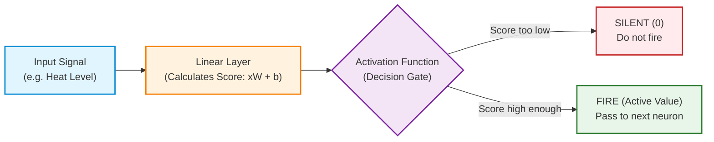
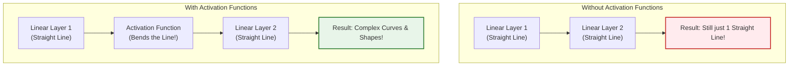

# Topic 7: Activation Functions (The ON/OFF Switch of Neural Networks)

> [!IMPORTANT]
> **No prior math knowledge required!** If previous math formulas made no sense, don't worry. This guide explains activation functions using pure intuition, real-world stories, and simple examples.

---

## 1. What is an Activation Function? (The Core Intuition)

Imagine your brain. You have billions of connected brain cells called **neurons**. 

When you see a hot stove:
1. Your eyes send a signal to your brain neurons.
2. The neurons calculate how hot it is.
3. If the signal is weak (warm air), the neuron stays **SILENT** (0).
4. If the signal is strong (scalding heat!), the neuron **FIRES** (1) and sends a panic signal to pull your hand back!



An **Activation Function** is simply the **ON/OFF decision gate** inside a neuron that determines:
> *"Is this information important enough to FIRE to the next neuron, or should I block it?"*

---

## 2. Why do we NEED them? (The Straight Line Problem)

Why can't we just use our formula from Topic 6 ($y = xW + b$)?

### The Drawing Analogy:
* **Linear Layers ($xW + b$) can ONLY draw straight lines.**
* Imagine trying to draw a picture of a **Cat**, a **Car**, or a **Human Face** using ONLY ruler-straight lines without bending or curving. It's impossible! Real-world data is full of curves, twists, and complex patterns.



> [!NOTE]
> If you stack 100 Linear Layers without activation functions, mathematically they collapse into **1 single linear layer**. Activation functions bend the lines into curves so the neural network can learn complex things like human language!

---

## 3. The 3 Main Activation Functions Explained Simply

### 1️⃣ Sigmoid — The "Probability Converter" (Squeezes to 0% - 100%)

* **What it does:** Takes any number (no matter how giant or negative) and squeezes it into a range between **0.0 and 1.0** (0% to 100%).
* **Real-World Example:** Exam Pass Probability.
  * Score = `-50` $\rightarrow$ Sigmoid turns it to `0.00` (0% chance of passing)
  * Score = `0` $\rightarrow$ Sigmoid turns it to `0.50` (50% chance of passing)
  * Score = `+50` $\rightarrow$ Sigmoid turns it to `1.00` (100% chance of passing)

```text
Input Number:  -10.0    -2.0     0.0     +2.0    +10.0
                │        │        │        │        │
Sigmoid Output: 0.0000  0.1192   0.5000   0.8808   0.9999
               (0%)    (12%)    (50%)    (88%)    (100%)
```

---

### 2️⃣ ReLU (Rectified Linear Unit) — The "Negative Eraser"

* **What it does:** The simplest function in AI. If a number is **positive**, keep it. If a number is **negative**, turn it into **0**.
* **Real-World Example:** Bank Balance for Shopping.
  * Money = `-$100` $\rightarrow$ You can buy `0` items (debt doesn't buy items!).
  * Money = `+$50` $\rightarrow$ You can buy `$50` worth of items.

```text
Input Number:  -10.0    -2.0     0.0     +2.0    +10.0
                │        │        │        │        │
ReLU Output:    0.0      0.0     0.0      2.0     10.0
               (Erased) (Erased) (Zero)  (Kept)   (Kept)
```

---

### 3️⃣ GELU (Gaussian Error Linear Unit) — The "Modern LLM Standard"

* **What it does:** Similar to ReLU, but instead of an abrupt 90-degree sharp corner at 0, it has a **smooth, gentle curve**. It lets a tiny fraction of negative numbers slip through (e.g. `-0.04`) before going up.
* **Why it matters:** **Used by ChatGPT, GPT-4, LLaMA, and Claude!** The smooth curve stops neurons from getting permanently "dead" (stuck at zero forever) during training.

```text
Input Number:  -10.0    -2.0     0.0     +2.0    +10.0
                │        │        │        │        │
GELU Output:    0.0     -0.04    0.0      1.95    10.0
               (Erased) (Tiny)  (Zero)   (Smooth) (Kept)
```

---

## 4. Summary Table: Quick Comparison

| Activation Function | What it does | Range | Best Used For |
| :--- | :--- | :--- | :--- |
| **Sigmoid** | Squeezes numbers into 0 to 1 | `[0, 1]` | Output layer for Yes/No predictions & Probabilities |
| **ReLU** | Erases negatives to 0, keeps positives | `[0, ∞)` | Fast hidden layers in computer vision & basic networks |
| **GELU** | Smooth curve, tiny negative leakage | `(-0.17, ∞)` | **Modern LLMs & Transformers (GPT, LLaMA)** |

---

## 5. Knowledge Check (Pop Quiz!)

**Question 1: Why can't a neural network learn complex things (like recognizing faces) using ONLY Linear Layers ($y = xW + b$)?**
* **Answer:** Because linear layers can only make straight-line predictions!
* **Reasoning:** Without activation functions to bend straight lines into curves, stacking 100 linear layers is mathematically identical to using just 1 linear layer.

**Question 2: If a linear layer outputs the number `-5.0`, what will ReLU output?**
* **Answer:** `0.0`
* **Reasoning:** ReLU erases all negative numbers and converts them to zero ($\max(0, -5.0) = 0$).

**Question 3: Which activation function is used in modern Large Language Models (LLMs) like GPT and LLaMA, and why?**
* **Answer:** GELU
* **Reasoning:** GELU has a smooth curve around zero instead of a sharp 90-degree corner, which prevents neurons from dying during training and keeps LLM learning stable.

---
**Next Step:** Head over to `Practical_Workspace/Phase1_DeepLearning_Foundations/Topic7_activation_functions.py` to run the code and see these exact numbers printed live!
