# 👑 The Complete 20-Pillar Master Roadmap: Enterprise Small Language Model (SLM) Ecosystem

Welcome to the Masterclass Blueprint for building, training, aligning, evaluating, optimizing, and deploying a production-grade Small Language Model (SLM) from absolute scratch.

This document serves as the definitive engineering specification for the `slm_realtime_project` codebase.

> [!IMPORTANT]
> **Written for two readers at once.** Every pillar below has a plain-English "🧒 In Plain Words" box first (no jargon — a school student should be able to follow it), followed by the full technical specification (for a CSE/engineering student who needs the exact numbers and terms). Read the box first, then the bullets.

---

## 🔒 Version Lock Policy — Read This First

Once a roadmap is "finished," constantly rewriting it causes scope creep and makes it useless as a fixed target. So this document works like a signed contract:

1. **Pillars 1–20 below are LOCKED as of v1.0.** Once finalized, their wording and numbering do not change. This is your fixed target — you build toward it without the goalposts moving.
2. **Nothing gets deleted or silently edited.** If something in Pillars 1–20 turns out to be wrong or incomplete, it is **not** fixed in place.
3. **New findings go into the [Addendum](#-pillar-21-known-gaps--additions-addendum--append-only-not-locked) at the bottom instead.** That section is explicitly **append-only** — new gaps get a new dated entry, old entries are never rewritten. This is the same idea as a legal contract amendment, or a `CHANGELOG.md`: the original stays intact, changes are additive and dated.
4. **Version history:**
   - `v1.0` — 2026-09-01 — Original 20 pillars locked.
   - `v1.1` — 2026-09-01 — Added beginner-friendly explanations, the End-to-End Points Roadmap, and Pillar 21 (Gaps Addendum). No content in Pillars 1–20 was changed, only explained.

---

## 🧭 The End-to-End Points Roadmap (Locked v1.0)

This is the **simple, ordered, walk-through-it-once checklist** version of the whole project — read top to bottom and you've mentally built the entire system. Every item maps to a Pillar below if you want the deep technical version. This list is also locked: check items off, don't rewrite them.

### Stage A — Get Ready (Pillar 1)
- [ ] 1. Install Python, PyTorch, and the other exact tool versions the project needs, so the code behaves the same on every machine.
- [ ] 2. Check what your computer/GPU can actually do (how much memory it has, what math tricks — like BF16 — it supports).
- [ ] 3. If using more than one computer/GPU, set up a way for them to talk to each other during training.

### Stage B — Collect the "Textbooks" (Pillar 2)
- [ ] 4. Decide the mix of reading material: general web text, math, and code.
- [ ] 5. Download it in parallel, in chunks, and verify nothing got corrupted (checksums).
- [ ] 6. Store it compressed, in organized shards, so it's cheap to keep and fast to read later.

### Stage C — Clean the Textbooks (Pillars 3 & 4)
- [ ] 7. Throw out garbage text (too short, too repetitive, gibberish).
- [ ] 8. Remove near-duplicate pages so the model doesn't waste time re-reading the same thing.
- [ ] 9. Strip out personal information (emails, phone numbers, API keys).
- [ ] 10. Filter out hateful, violent, or dangerous content.
- [ ] 11. Optionally, generate extra "practice reasoning" examples to add to the mix.

### Stage D — Teach It the Alphabet (Pillar 5)
- [ ] 12. Build the model's own dictionary of sub-word "puzzle pieces" (tokens) from your cleaned text.
- [ ] 13. Add special marker tokens (start of text, end of text, start/end of a chat turn).
- [ ] 14. Sanity-check the dictionary — make sure it doesn't take way more tokens than expected to write a normal sentence.

### Stage E — Design the Brain (Pillars 6 & 7)
- [ ] 15. Decide the size of the brain: how many layers, how wide each layer is, how many "attention heads."
- [ ] 16. Add the stability tricks (normalization) that keep training from blowing up.
- [ ] 17. Add the mechanism that lets the model know word order and handle long passages of text.

### Stage F — Package the Data for Speed (Pillar 8)
- [ ] 18. Convert all cleaned text into one big, tightly packed binary file (not living document files) so reading it during training is instant.
- [ ] 19. Set it up so training can stream from disk without loading everything into memory at once.

### Stage G — Set Up the Training Machine (Pillar 9)
- [ ] 20. Decide how the workload is split across GPUs (if more than one).
- [ ] 21. Use reduced-precision math (BF16/FP16) to fit more in memory and train faster.
- [ ] 22. Watch memory usage closely so the training doesn't crash halfway through.

### Stage H — Actually Train It (Pillar 10)
- [ ] 23. Pick the optimizer (the "study method") and its settings.
- [ ] 24. Start with a slow warmup, ramp up, then slowly cool down the learning speed over time.
- [ ] 25. Put a safety cap on how much any single update can change the model, and watch for sudden "loss spikes" that mean something broke.

### Stage I — Watch It Learn & Save Progress (Pillar 11)
- [ ] 26. Log live stats (loss, speed, memory) to a dashboard so you can see if training is going well.
- [ ] 27. Save the model's "brain state" regularly.
- [ ] 28. Make sure you can stop and resume training from a saved point without losing progress.

### Stage J — Teach It to Chat (Pillar 12)
- [ ] 29. Format example conversations using a consistent chat template.
- [ ] 30. Only grade the model on the *assistant's* replies, not the user's questions, during this stage.

### Stage K — Teach It Cheaply & Give It New Skills (Pillar 13)
- [ ] 31. Instead of retraining the whole brain, attach small trainable "add-on" layers (LoRA) for new skills.
- [ ] 32. Optionally shrink the base model to 4-bit precision first to save memory (QLoRA), then merge the add-ons back in when done.

### Stage L — Teach It Taste (Pillar 14)
- [ ] 33. Collect pairs of answers: one "better," one "worse," for the same question.
- [ ] 34. Train the model to prefer the better-style answer (DPO/ORPO), without needing a separate reward model.

### Stage M — Make It Safe (Pillar 15)
- [ ] 35. Teach the model when and how to politely refuse unsafe requests.
- [ ] 36. Actively try to "jailbreak" your own model and patch what you find before anyone else does.

### Stage N — Grade It (Pillar 16)
- [ ] 37. Measure how well it predicts text (perplexity) as a health check.
- [ ] 38. Run it through standardized exams (MMLU, ARC, HellaSwag, GSM8k) to compare it to other models.
- [ ] 39. Have humans, or another strong AI acting as a judge, rate real conversation quality.

### Stage O — Shrink It for the Real World (Pillar 17)
- [ ] 40. Export a compressed version (GGUF) that can run on a regular CPU/laptop.
- [ ] 41. Optionally compress further to 4-bit weights (AWQ/GPTQ).
- [ ] 42. Optionally train a smaller "student" model to copy a bigger "teacher" model's behavior.

### Stage P — Make It Respond Instantly (Pillar 18)
- [ ] 43. Build a short-term memory (KV-cache) so it doesn't "re-read" the whole conversation for every new word.
- [ ] 44. Let it handle many users' requests together efficiently (batching).
- [ ] 45. Add controls for how random/creative vs. focused its answers are (temperature, top-k, top-p).

### Stage Q — Put It On the Internet (Pillar 19)
- [ ] 46. Build a web server that streams the model's answer word-by-word as it's generated.
- [ ] 47. Handle many requests at once with a queue, and prevent overload/abuse.

### Stage R — Ship It Safely, Forever (Pillar 20)
- [ ] 48. Track live health metrics (how fast the first word appears, how fast each next word appears).
- [ ] 49. Automatically test every code change before it's allowed to ship.
- [ ] 50. Package it in a container so it runs the same way anywhere, including small edge devices.

---

## 🏛️ The 20 Pillars of Production SLM Engineering

### 📍 Pillar 1: System Infrastructure and Environment Rigor

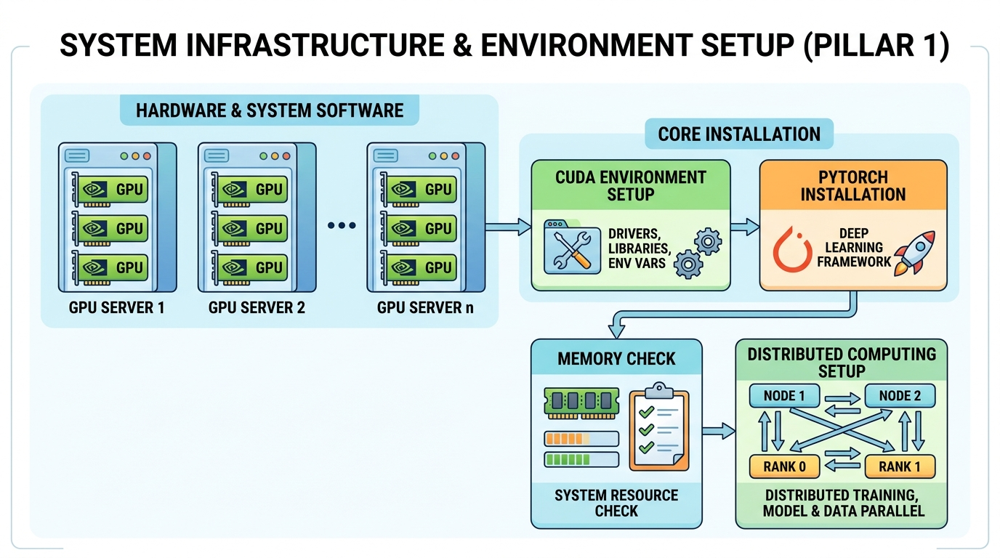

> 🧒 **In Plain Words:** Before you cook a meal, you gather the right pots, pans, and ingredients so nothing goes wrong halfway through. This pillar is that setup step — installing the right software versions and checking what your computer can handle — done *before* any real work starts.

- 1.1 Deterministic Environment Pinning (PyTorch, Triton, Transformers, Datasets, Tokenizers, FastAPI, WandB).
- 1.2 Compute Capability Discovery (CUDA Compute Capability, Tensor Cores, native BF16, VRAM limits).
- 1.3 Distributed Process Group Initialization (torch.distributed with NCCL/Gloo).

### 📍 Pillar 2: Corpus Acquisition and Pipeline Orchestration

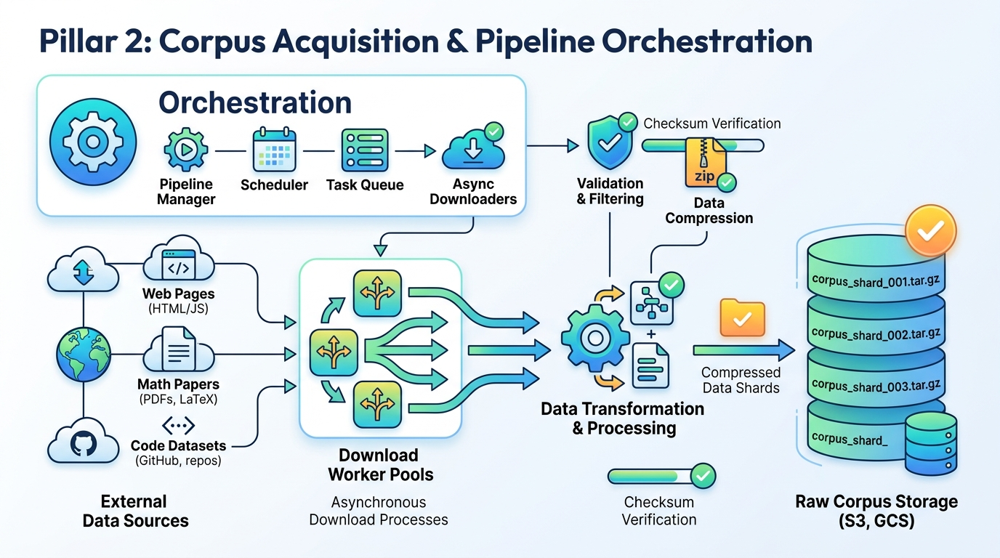

> 🧒 **In Plain Words:** A student can't write a good essay without reading a lot of books first. This pillar downloads and organizes the "books" — text data — that the AI will read and learn from.

- 2.1 Multi-Domain Dataset Blending (FineWeb-Edu 60%, OpenWebMath 20%, Code subsets 20%).
- 2.2 Asynchronous Ingestion and Sharding (Multi-threaded chunk downloaders with MD5 checksums).
- 2.3 Cold Storage and Sharding Topology (Compressed JSONL/Parquet Zstandard .zst archives).

### 📍 Pillar 3: Data Quality Engine and MinHash LSH Deduplication

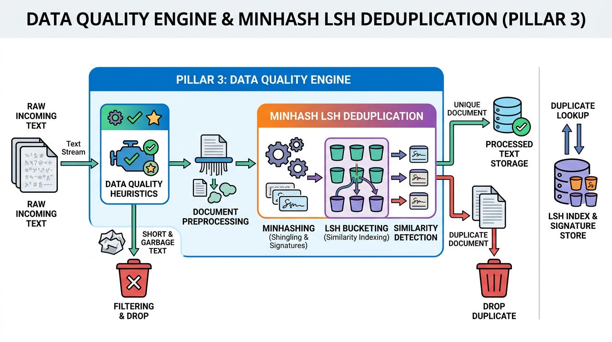

> 🧒 **In Plain Words:** If you read the exact same page twice, you don't actually learn anything new — it just wastes time. This pillar finds and removes near-identical text so the AI's study time isn't wasted.

- 3.1 Heuristic Quality Filters (Length ratio, character diversity, perplexity thresholds).
- 3.2 MinHash LSH Deduplication (13-shingle, 128 permutation functions, Jaccard threshold >= 0.8).

### 📍 Pillar 4: PII Scrubbing, Safety and Toxicity Scrubbing

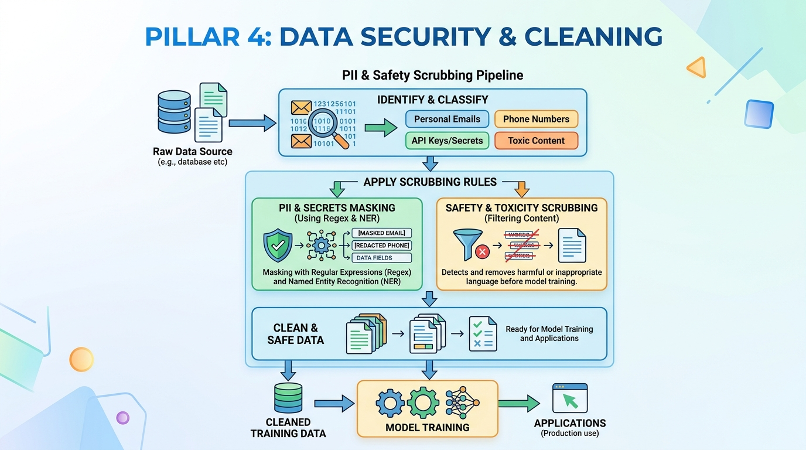

> 🧒 **In Plain Words:** Like a teacher blacking out a student's home address before pinning their essay on the wall, and removing violent or hateful pages from a textbook before handing it out.

- 4.1 PII Masking (Strip emails, IP addresses, API keys, phone numbers via regex and NER).
- 4.2 Toxicity Filtering (Filter hate speech, dangerous prompts, illegal instructions).
- 4.3 Synthetic Text Augmentation (Self-instruct reasoning chains).

### 📍 Pillar 5: Custom BPE Tokenizer Engine and Vocabulary Audit

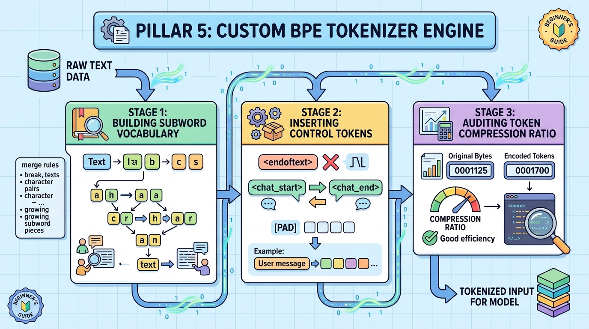

> 🧒 **In Plain Words:** The AI doesn't read whole words like we do — it breaks language into small puzzle pieces (like syllables). This pillar builds the AI's own personal dictionary of those puzzle pieces.

- 5.1 Byte-Pair Encoding (BPE) Training (8,192 or 32,768 vocabulary size with byte-fallback).
- 5.2 Control Tokens Injection (`<|endoftext|>`, `<|im_start|>`, `<|im_end|>`, `<|pad|>`).
- 5.3 Token Compression Audit (Tokens-per-word ratio benchmark).

### 📍 Pillar 6: Deep Neural Network Architecture Specifications

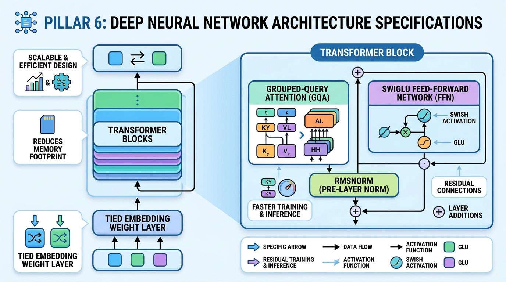

> 🧒 **In Plain Words:** This is the blueprint of the AI's "brain" — how many layers of artificial neurons it has, how wide each layer is, and how they connect to each other.

- 6.1 Parameter Math (Hidden Dim d=256, Layers L=8, Query Heads nh=8, KV Heads nkv=2 GQA 4:1, d_ffn=1024).
- 6.2 Pre-Layer RMSNorm for numerical training stability.
- 6.3 Grouped-Query Attention (GQA) and SwiGLU Feed-Forward Networks.
- 6.4 Weight Tying (Connect embedding weights with output LM head).

### 📍 Pillar 7: Rotary Position Embeddings (RoPE) and YaRN Context Scaling

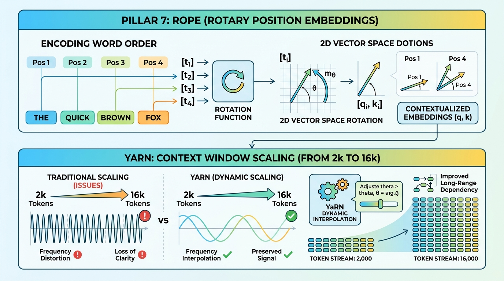

> 🧒 **In Plain Words:** Imagine reading a book with no page numbers — you'd get lost. This pillar gives the AI a sense of word order, plus a trick that lets it "remember" and read longer passages than it originally trained on.

- 7.1 Complex Rotary Position Embeddings (RoPE).
- 7.2 YaRN Context Scaling (Extend context length from 2,048 to 16,384 tokens).

### 📍 Pillar 8: High-Throughput Memory-Mapped Binary Data Packing

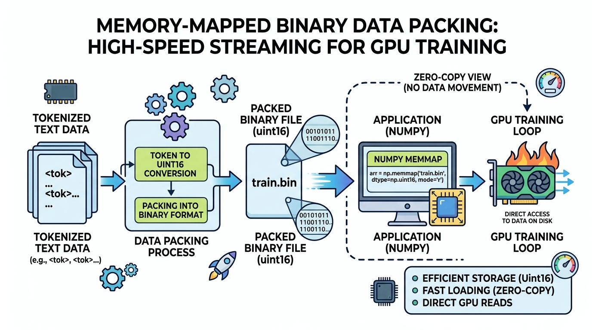

> 🧒 **In Plain Words:** Instead of keeping loose sheets of paper in a messy pile, you organize everything into one tightly packed, indexed library so any page can be found and read instantly.

- 8.1 Binary Array Packing (Compressed uint16 train.bin, val.bin).
- 8.2 Zero-Copy Memory-Mapped Access (np.memmap streaming dataloader).
- 8.3 Causal Shift and Sequence Packing.

### 📍 Pillar 9: Pre-Training Infrastructure and Memory Profiling

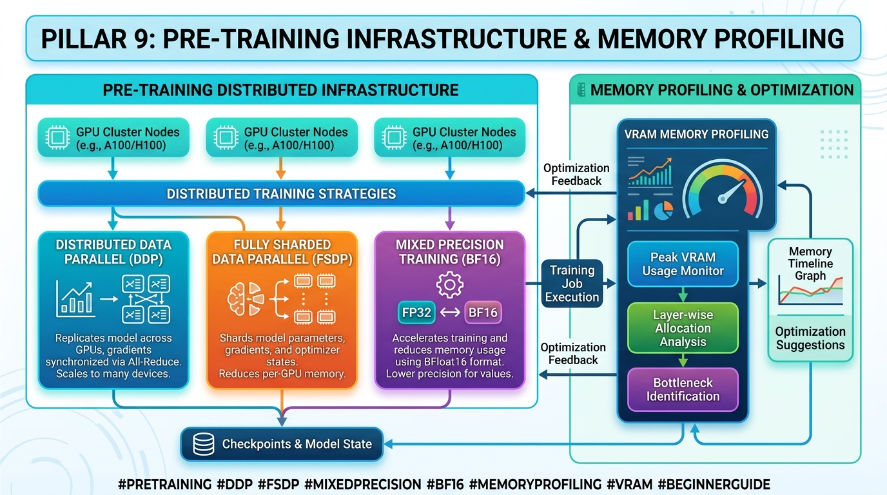

> 🧒 **In Plain Words:** Setting up multiple computers to study as a team, and constantly checking that none of them run out of "notebook space" (memory) while learning.

- 9.1 PyTorch FSDP and Distributed Data Parallel (DDP).
- 9.2 Mixed Precision Training (BF16 / FP16 AMP + GradScaler).
- 9.3 VRAM Profiling and Gradient Accumulation.

### 📍 Pillar 10: Optimization Mechanics and Loss Spike Guardrails

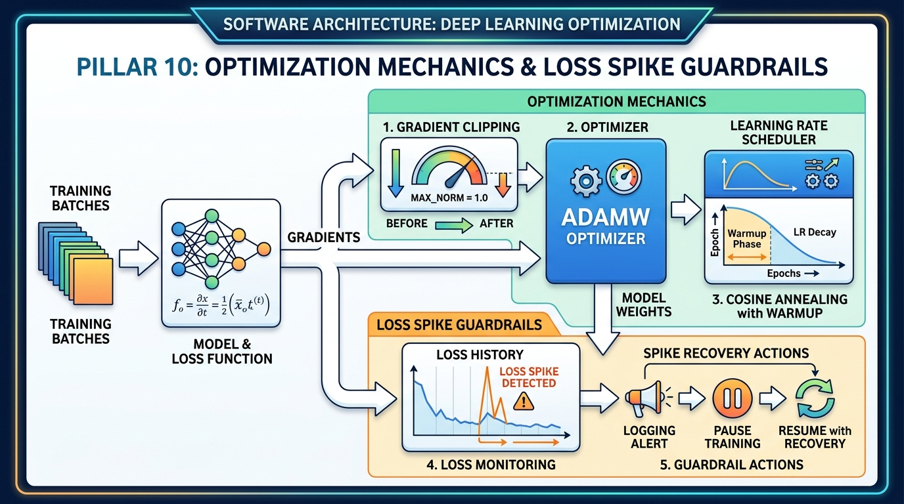

> 🧒 **In Plain Words:** This is the AI's study method — how hard it pushes itself after every practice question, and a safety plan for what to do if it suddenly "panics" and starts learning the wrong things.

- 10.1 AdamW Optimizer Setup (beta1=0.9, beta2=0.95, weight decay=0.1).
- 10.2 Cosine Annealing LR Schedule (Linear warmup 5%, peak 1e-3, min 1e-4).
- 10.3 Gradient Clipping (max_norm=1.0) and Loss Spike Detection.

### 📍 Pillar 11: Real-Time Telemetry and Safetensors Checkpointing

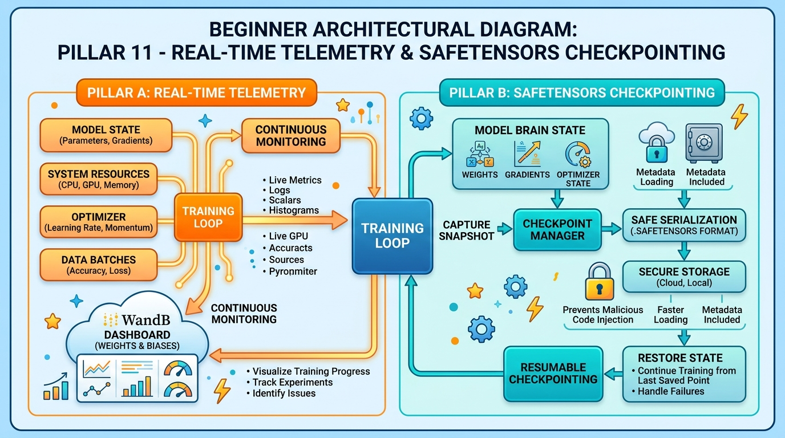

> 🧒 **In Plain Words:** Taking regular photographs of the AI's brain while it studies, and writing its exam scores on a dashboard — so if the computer crashes, you don't lose all its progress.

- 11.1 Real-Time Metrics Tracking (WandB and TensorBoard integration).
- 11.2 Checkpointing and Safetensors Export.
- 11.3 Resumable State Checkpoints.

### 📍 Pillar 12: Supervised Fine-Tuning (SFT) and ChatML Prompting

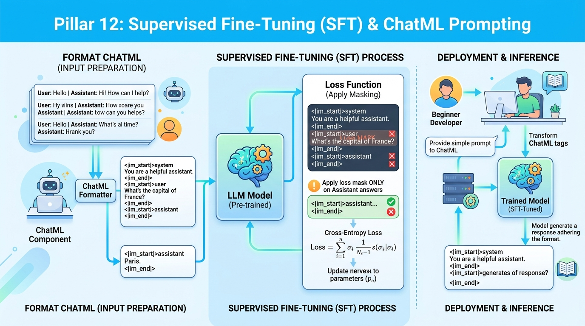

> 🧒 **In Plain Words:** Teaching the AI good conversation manners by showing it thousands of examples of "question in, good answer out," so it learns to behave like a helpful chatbot instead of just finishing sentences.

- 12.1 ChatML Template Formatter (`<|im_start|>`, `<|im_end|>`).
- 12.2 Masked Assistant Loss (Calculate loss ONLY on response tokens).

### 📍 Pillar 13: Parameter-Efficient Fine-Tuning (LoRA and QLoRA Engine)

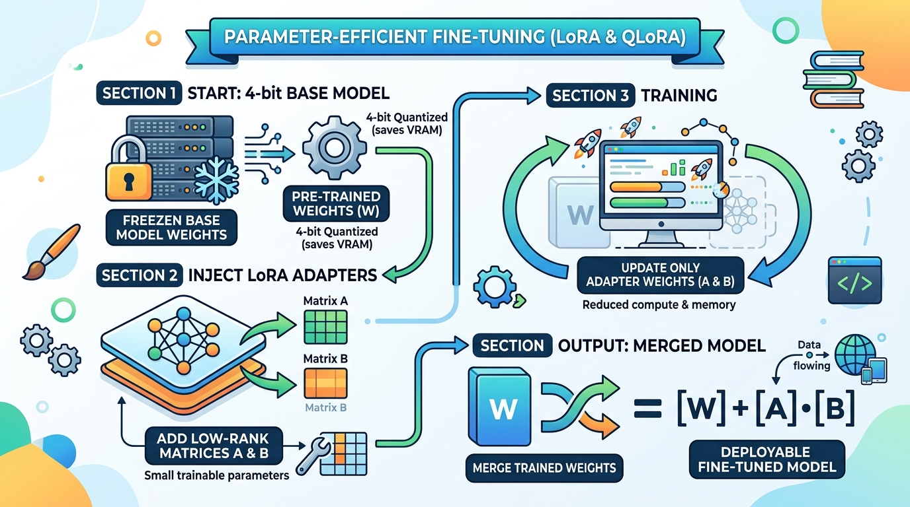

> 🧒 **In Plain Words:** Instead of re-teaching the *entire* brain from scratch to learn a new skill, you attach small "sticky notes" of new knowledge on top — much cheaper and faster than a full re-education.

- 13.1 Custom LoRA Layer Injection (W + (alpha/r) * A * B).
- 13.2 QLoRA (NF4 4-bit Base + 16-bit LoRA Adapters).
- 13.3 Weight Merging Engine.

### 📍 Pillar 14: Preference Alignment (DPO, IPO and ORPO)

> 🧒 **In Plain Words:** Teaching the AI *taste*. You show it two answers to the same question — one better, one worse — and it learns to prefer the better style, like a teacher marking up two essay drafts side by side.

- 14.1 Preference Dataset Processing (Prompt, Chosen, Rejected pairs).
- 14.2 Direct Preference Optimization (DPO Loss).
- 14.3 ORPO (Odds Ratio Preference Optimization).

### 📍 Pillar 15: Safety Guardrails and Red-Teaming Audits

> 🧒 **In Plain Words:** Hiring "friendly hackers" to try every trick to make your AI misbehave, so you can find and fix the weak spots before a real stranger on the internet finds them.

- 15.1 System Refusal Alignment.
- 15.2 Red-Teaming Jailbreak Evaluation.

### 📍 Pillar 16: Comprehensive Evaluation and Benchmark Suite

> 🧒 **In Plain Words:** Giving the AI a standardized exam (like an SAT) so you can measure, with real numbers, how smart it actually turned out to be — and compare it fairly to other AIs.

- 16.1 Automated Perplexity (PPL) Evaluation.
- 16.2 Standard Benchmarks (MMLU, ARC-Easy/Challenge, HellaSwag, GSM8k).
- 16.3 Human and LLM-as-a-Judge Evaluation.

### 📍 Pillar 17: Model Compression, Quantization (GGUF/AWQ) and Distillation

> 🧒 **In Plain Words:** Shrinking the AI down so it can run on smaller devices, like a laptop or phone, without losing too much of its intelligence — like a condensed "study guide" version of a giant textbook.

- 17.1 GGUF Export for llama.cpp / Edge CPU execution.
- 17.2 AWQ and GPTQ 4-Bit Weight Quantization.
- 17.3 Knowledge Distillation from 7B/70B Teacher Models.

### 📍 Pillar 18: Real-Time KV-Cache Generator and Batching

> 🧒 **In Plain Words:** Giving the AI a short-term memory so it doesn't have to "re-read" the entire conversation from scratch before saying every single new word. This is what makes it feel fast and real-time instead of laggy.

- 18.1 Key-Value (KV) Cache Engine (O(1) token latency).
- 18.2 Dynamic Continuous Batching.
- 18.3 Temperature, Top-K, Top-P Nucleus Decoding.

### 📍 Pillar 19: Production API Server (FastAPI SSE and WebSockets)

> 🧒 **In Plain Words:** Building the "front desk" that lets many people talk to the AI at the same time over the internet, with answers streaming in word-by-word instead of appearing all at once.

- 19.1 FastAPI Async Server with Server-Sent Events (SSE).
- 19.2 Request Queue Management and Worker Pools.
- 19.3 Rate Limiting and Security Headers.

### 📍 Pillar 20: CI/CD Pipeline, Monitoring and Edge Deployment

> 🧒 **In Plain Words:** The quality-control line of a factory — every change is automatically tested before it ships, the finished product is boxed up (containerized) so it runs the same way anywhere, and you keep watching its health after it goes live.

- 20.1 Real-Time Observability (TTFT < 30ms, ITL < 10ms, Prometheus metrics).
- 20.2 GitHub Actions CI/CD Integration Testing.
- 20.3 Docker Edge Containerization.

---

## 🕳️ Pillar 21: Known Gaps & Additions (Addendum — append-only, NOT locked)

> [!NOTE]
> This section exists *because* Pillars 1–20 are locked. When a gap is found later, it is added here as a new dated entry — the original pillars above are never rewritten. Think of this like an amendment to a contract, not an edit to it.

### 21.1 Train/Eval Contamination Check — *Added v1.1, 2026-09-01*
> 🧒 **In Plain Words:** Before giving a student a final exam, you'd want to make sure the exam questions weren't secretly slipped into their study notes beforehand — otherwise they're just remembering, not actually understanding.

Before running Pillar 16's benchmarks, scan the training corpus (Pillar 2/3) for near-duplicate overlap with benchmark question sets (MMLU, GSM8k, HellaSwag, ARC). Without this, evaluation scores can be inflated by memorization rather than genuine capability, and are not trustworthy or comparable to published leaderboards.

### 21.2 Scaling-Law / Compute-Optimal Token Budget — *Added v1.1, 2026-09-01*
> 🧒 **In Plain Words:** A bigger brain needs more studying to reach its full potential, and a smaller brain can only absorb so much before more studying stops helping. This step does the math to figure out the *right amount* of text to train on for the brain size chosen in Pillar 6.

Given Pillar 6's parameter count, compute the Chinchilla-style compute-optimal token count (roughly 20 tokens per parameter as a starting reference point) and use that number to size Pillar 2's corpus target, rather than picking a corpus size arbitrarily.

### 21.3 Data Licensing and Provenance Tracking — *Added v1.1, 2026-09-01*
> 🧒 **In Plain Words:** Keep a receipt for every "book" used to teach the AI, so you can prove where each piece of knowledge came from and that you were allowed to use it.

Alongside PII scrubbing (Pillar 4), maintain a manifest of each dataset's source, license, and collection date. This matters before any public release of data or model weights, and protects against downstream legal/compliance issues.

### 21.4 Reproducibility and Seed Pinning — *Added v1.1, 2026-09-01*
> 🧒 **In Plain Words:** Lock every "random dice roll" the training process makes, so running the exact same experiment twice gives the exact same result — like following a recipe exactly so the cake always comes out the same.

Pin random seeds (Python, NumPy, PyTorch, data shuffling order) and log them alongside every run in Pillar 11's telemetry, so any run can be exactly reproduced or fairly compared against another.

### 21.5 Standardized Evaluation Harness — *Added v1.1, 2026-09-01*
> 🧒 **In Plain Words:** Use the same official, trusted exam-grading tool that everyone else uses, instead of grading your own exam by hand — otherwise nobody can trust that your AI's score means what you say it means.

Run Pillar 16's benchmarks through a standardized, widely-used tool (e.g. `lm-evaluation-harness`) rather than custom scoring scripts, so results are directly comparable to published model leaderboards.

### 21.6 Canary Rollout and Rollback Plan — *Added v1.1, 2026-09-01*
> 🧒 **In Plain Words:** When releasing a new version, show it to a small group first and watch closely, with a big red "undo" button ready — instead of releasing to everyone at once and hoping nothing breaks.

Extend Pillar 20's CI/CD with a staged rollout (small % of traffic first) and an automatic rollback path if error rates or latency (Pillar 20.1) regress, rather than deploying directly to 100% of production traffic.
